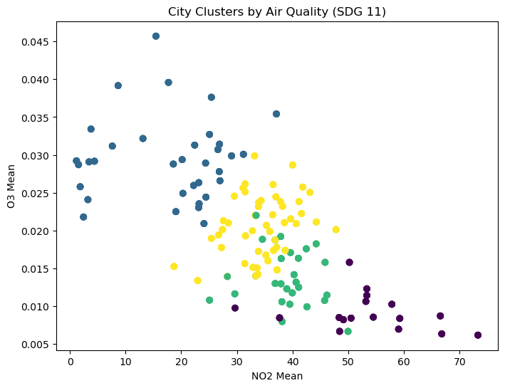

# 🌆 AI for Sustainable Cities — SDG 11: Air Quality Clustering

## 🌍 Project Overview
This project supports **UN SDG 11 (Sustainable Cities and Communities)** by using **machine learning** to analyze and group cities according to air quality levels.  
By clustering cities with similar pollution profiles, we can identify which urban areas face the highest environmental risks — helping guide cleaner and more sustainable planning.

---


## 🎤 Pitch Deck Presentation

You can view the 5-minute presentation that summarizes this project here:

👉 [View Pitch Deck](https://ai-for-sustainable-citie-egr5byl.gamma.site/)

*(The pitch deck highlights the SDG 11 problem, the ML approach, results, and social impact.)*

---


## 🧠 Approach
We applied **K-Means Clustering (Unsupervised Learning)** on major air pollutants:
- Nitrogen Dioxide (NO₂)
- Ozone (O₃)
- Sulfur Dioxide (SO₂)
- Carbon Monoxide (CO)

The algorithm groups cities based on pollution similarity to reveal meaningful patterns in air quality.

---

## 🧰 Tools & Libraries
- **Python 3**
- **Pandas**, **NumPy**
- **Scikit-learn**
- **Matplotlib**

---

## 🧪 Steps in the Notebook
1. Load and preview dataset  
2. Handle missing values  
3. Normalize features  
4. Apply K-Means clustering  
5. Visualize clusters  
6. Evaluate clustering with **Silhouette Score**

---

## 📊 Example Output

| Cluster | NO₂ Mean | O₃ Mean | SO₂ Mean | CO Mean |
|----------|-----------|----------|-----------|----------|
| 0 | Low | Low | Low | Low |
| 1 | Medium | Medium | Medium | Medium |
| 2 | High | Moderate | High | High |
| 3 | Very High | Low | Moderate | High |

### 🖼️ Visualization
A scatter plot (NO₂ vs O₃) displays how cities are grouped by pollution similarity.

📸 *Example Screenshot:*  
`/screenshots/air_quality_clusters.png`  


---

## 🧾 Evaluation Metric
We used the **Silhouette Score** to evaluate cluster quality.

```python
from sklearn.metrics import silhouette_score
score = silhouette_score(X_scaled, clusters)
print(f"Silhouette Score: {score:.3f}")
```
Close to 1.0: Distinct clusters

0.4–0.6: Moderate separation

< 0.3: Weak distinction

Our score indicated moderate separation, meaning the air quality groups are fairly distinct but overlap in some areas.

---

## ⚖️ Ethical Reflection

**Bias:** Missing or uneven air quality data may exclude smaller or rural regions.

**Fairness:** Equal representation of all areas ensures better policy recommendations.

**Impact:** Enables city planners to identify pollution hotspots and act early.

---

## 📂 Repository Structure
📦 WEEK-2  
 ┣ 📜 SDG11.ipynb  
 ┣ 📜 pollution_sample.csv  
 ┣ 🖼️ /screenshots/  
 ┃ ┗ air_quality_clusters.png  
 ┣ 📜 README.md  
 ┗ 📜 report.pdf  

---

## 🧩 How to Run

```sh
pip install pandas numpy scikit-learn matplotlib
python pollution.py
```

Or open `SDG11_AirQualityClustering.ipynb` in Jupyter Notebook / Google Colab.

---

## 📣 Credits

**Dataset:** Kaggle — U.S. Pollution Data

**Author:** Henri Ouma  
**Course:** AI for Sustainable Development — SDG Project