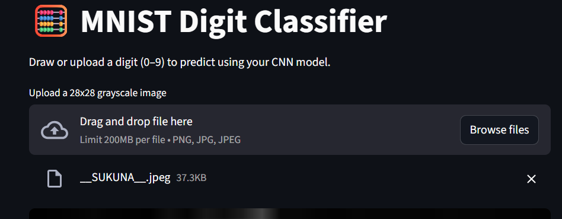

# 🧠 AI Tools and Applications Assignment

## 📘 Overview

This repository contains the implementation and analysis for the **AI Tools and Applications** assignment.  
The project demonstrates practical and theoretical understanding of **AI frameworks**, including **Scikit-learn**, **TensorFlow**, and **spaCy**, and their use in real-world AI problem-solving.

---

## 🧩 Project Structure
```
AI_Tools_Assignment/
│
├── datasets/ # Contains datasets used for training and evaluation
│ ├── Iris.csv
│ ├── mnist.npz
│ └── amazon_reviews.csv
│
├── notebooks/ # Jupyter notebooks for each practical task
│ ├── iris_decision_tree.ipynb # Classical ML (Scikit-learn)
│ ├── mnist_cnn.ipynb # Deep Learning (TensorFlow)
│ └── spacy_ner_sentiment.ipynb # NLP (spaCy)
│
├── results/ # Saved metrics, graphs, and screenshots
│ ├── iris_confusion_matrix.png
│ ├── iris_decision_tree.png
│ ├── mnist_accuracy_graph.png
│ ├── mnist_app_screenshot.png
│ ├── mnist_cnn_model.h5
│ ├── mnist_sample_predictions.png
│ ├── spacy_ner_output.png
│ └── spacy_ner_results.csv
│
├── report/ # Final report (PDF format)
│ └── WEEK 3 PLP ASSIGNMENT PDF.pdf
│
├── mnist_app.py # Streamlit app for MNIST model deployment
└── README.md # Project documentation
```
---

## 🧠 Part 1: Theoretical Understanding

### Short Answer Questions

1. **TensorFlow vs PyTorch** – Differences in execution, flexibility, and deployment use cases.
2. **Use Cases of Jupyter Notebooks** – Interactive exploration, visualization, and reproducible experiments.
3. **spaCy in NLP** – Enhances efficiency with pre-trained pipelines and NER, beyond manual text handling.

### Comparative Analysis

| Framework        | Best For                   | Ease of Use       | Community Support |
| ---------------- | -------------------------- | ----------------- | ----------------- |
| **Scikit-learn** | Classical ML models        | Beginner-friendly | Excellent         |
| **TensorFlow**   | Deep learning & production | Moderate          | Excellent         |

---

## ⚙️ Part 2: Practical Implementation

### 🪴 Task 1 – _Classical ML with Scikit-learn_

- Dataset: **Iris Species**
- Model: **Decision Tree Classifier**
- Metrics: Accuracy, Precision, Recall

### ✨ Task 2 – _Deep Learning with TensorFlow_

- Dataset: **MNIST Handwritten Digits**
- Model: **Convolutional Neural Network (CNN)**
- Accuracy: >95%
- Bonus: **Deployed via Streamlit**

### 🗣️ Task 3 – _NLP with spaCy_

- Dataset: **Amazon Product Reviews**
- Tasks: Named Entity Recognition + Rule-based Sentiment Analysis

---

## 🤖 Part 3: Ethics & Optimization

- **Bias Detection:** Awareness of model bias in review sentiment and digit recognition.
- **Mitigation:** Tools like TensorFlow Fairness Indicators and spaCy rule-based checks.
- **Troubleshooting:** Fixing model dimension and loss function mismatches in TensorFlow.

---

## 🌐 Bonus: Streamlit Deployment

The trained **MNIST CNN model** is deployed via **Streamlit** for interactive digit recognition.

### 🔗 Live Demo

[👉 Launch the Streamlit App](http://localhost:8501)  


### 🖼️ App Preview

Below is a screenshot of the deployed interface:



Run locally with:

```bash
pip install streamlit pillow tensorflow
streamlit run mnist_app.py
```
